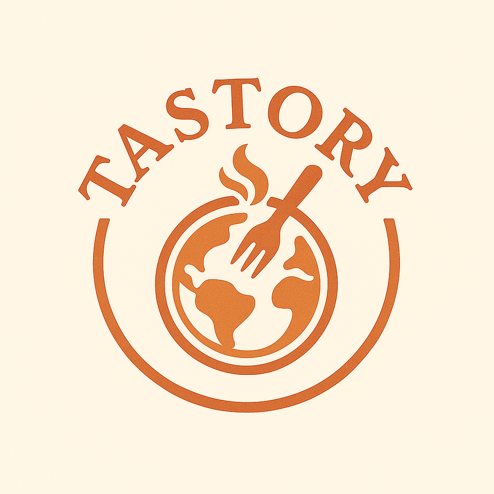

# Tastory - The Food Search Engine 🔍🍳

<p align="center">
  
</p>

<p align="center">
  <strong>The world's most advanced food search engine.</strong><br>
  Search 230,000+ recipes instantly using AI-powered semantic search.
</p>

<p align="center">
  <a href="#features">Features</a> •
  <a href="#why-tastory">Why Tastory</a> •
  <a href="#tech-stack">Tech Stack</a> •
  <a href="#getting-started">Getting Started</a>
</p>

---

## 🚀 What is Tastory?

Tastory is a powerful recipe search engine that helps you find the perfect recipe from a vast collection of over 230,000 recipes. Built with modern technology and optimized for speed, Tastory delivers relevant results in under 2 seconds.

## ✨ Features

### 🔍 **Advanced Search Capabilities**

- **Semantic Search**: Understands context and intent, not just keywords
- **Multi-language Support**: Search in English, Spanish, French, German, Italian, or Portuguese
- **Smart Suggestions**: Auto-complete based on popular searches
- **Voice Search**: Hands-free searching while cooking

### 🎯 **Search Engine Features**

- **Lightning Fast**: Results in under 2 seconds
- **Smart Ranking**: AI sorts by relevance, not just popularity
- **Visual Results**: Image-first design for quick browsing
- **Filter & Refine**: By cuisine, diet, time, difficulty

### 🗣️ **Interactive Features**

- **Text-to-Speech**: Recipe narration in multiple languages
- **Cooking Mode**: Step-by-step guidance (coming soon)
- **Favorites**: Save and organize your recipe collection
- **Dark Mode**: Easy on the eyes during late-night cooking

## 🤔 Why Tastory vs Generic Search?

| Feature              | Google/Bing      | ChatGPT        | **Tastory**           |
| -------------------- | ---------------- | -------------- | --------------------- |
| Food-specific search | ❌ Generic       | ❌ Generic     | ✅ **Built for food** |
| Recipe database      | ❌ Crawled web   | ❌ No database | ✅ **230K+ curated**  |
| Visual browsing      | ⚠️ Mixed results | ❌ Text only   | ✅ **Image-first**    |
| Cooking features     | ❌ None          | ❌ None        | ✅ **TTS, timers**    |
| Search speed         | ⚠️ Variable      | ⚠️ Slow        | ✅ **<2 seconds**     |
| Dietary filters      | ❌ Manual        | ❌ Manual      | ✅ **Built-in**       |

## 🛠️ Tech Stack

- **Frontend**: React, Material-UI, Webpack
- **Backend**: Python, Flask, MongoDB Atlas
- **AI/ML**: Sentence Transformers (all-MiniLM-L6-v2)
- **Database**: MongoDB with vector search indexes
- **Search**: Hybrid approach (semantic + text search)

## 🚦 Getting Started

### Prerequisites

- Python 3.8+
- Node.js 14+
- MongoDB Atlas account

### Installation

1. **Clone the repository**

   ```bash
   git clone https://github.com/OS366/Tastory.git
   cd Tastory
   ```

2. **Set up the backend**

   ```bash
   python -m venv venv
   source venv/bin/activate  # On Windows: venv\Scripts\activate
   pip install -r requirements.txt
   ```

3. **Configure environment**

   ```bash
   cp .env.example .env
   # Edit .env with your MongoDB connection string
   ```

4. **Set up the frontend**

   ```bash
   cd frontend
   npm install
   ```

5. **Run the application**

   Terminal 1 - Backend:

   ```bash
   python app.py
   ```

   Terminal 2 - Frontend:

   ```bash
   cd frontend
   npm start
   ```

6. **Open your browser**
   Navigate to `http://localhost:3000`

## 🎯 Search Examples

Try these searches to see Tastory in action:

- **By Ingredient**: "salmon with lemon"
- **By Time**: "quick breakfast under 15 minutes"
- **By Diet**: "keto chocolate cake"
- **By Cuisine**: "authentic pad thai"
- **By Method**: "instant pot chicken"
- **By Occasion**: "birthday party appetizers"

## 🔮 Future Roadmap

- [ ] **Advanced Filters**: Calorie ranges, macro tracking
- [ ] **Recipe Collections**: User-curated lists
- [ ] **Meal Planning**: Weekly meal prep assistance
- [ ] **Shopping Lists**: Ingredient aggregation
- [ ] **Social Features**: Share and rate recipes
- [ ] **API Access**: For developers and partners

## 📄 License

Tastory is available under dual licensing:

### Open Source License (AGPL-3.0)

The open-source version is licensed under the GNU Affero General Public License v3.0. This means you can:

- Use the software for non-commercial purposes
- Modify the code
- Distribute the code
- Must keep the source code open source if you distribute it

## Contributing

We welcome contributions! Please read our [Contributing Guidelines](CONTRIBUTING.md) before submitting pull requests.

## About

Tastory is developed by [David Labs](https://www.davidlabs.ca), a company dedicated to making cooking and recipe discovery easier for everyone.

---

<p align="center">
  <strong>Tastory - The Food Search Engine</strong><br>
  Making recipe discovery as easy as web search.
</p>
