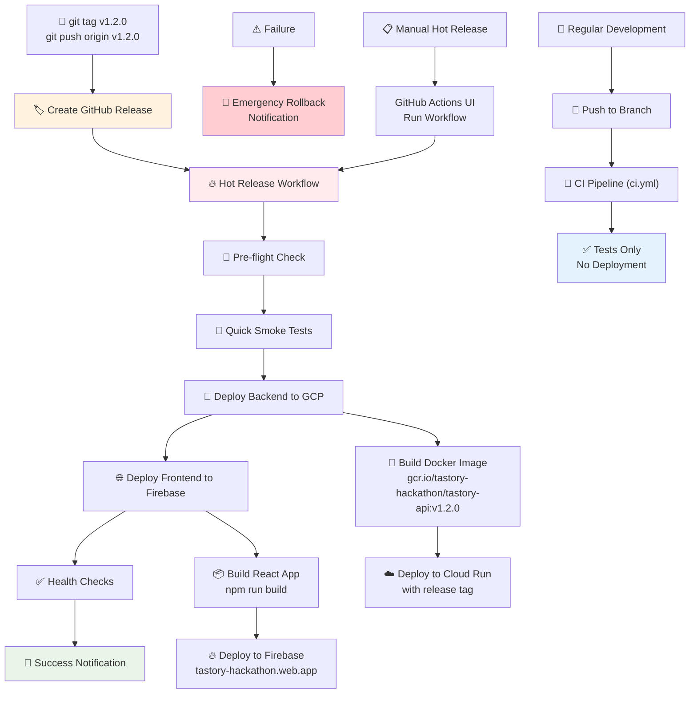

# 🔥 Hot Release Workflow Architecture

This diagram shows the complete hot release system for Tastory's deployment to GCP.

## Workflow Overview

## Key Components

### 🔥 Hot Release Path (Production)

1. **GitHub Release Creation** → Triggers automatic deployment
2. **Pre-flight Checks** → Validates release tag and type
3. **Smoke Tests** → Quick functionality verification
4. **Backend Deployment** → GCP Cloud Run with versioned Docker image
5. **Frontend Deployment** → Firebase Hosting with production build
6. **Health Verification** → Confirms services are responding
7. **Success Notification** → Deployment complete confirmation

### 🔄 Regular Development Path

1. **Branch Push** → Triggers CI pipeline only
2. **Comprehensive Testing** → All 78 tests must pass
3. **No Deployment** → Development builds don't deploy

### 📋 Manual Controls

- **Manual Hot Release** → Deploy specific release via GitHub Actions UI
- **Emergency Procedures** → Rollback notifications on failure

## Production URLs

- **Frontend**: https://tastory-hackathon.web.app
- **Backend**: https://tastory-api-vbx2teipca-uc.a.run.app

## Safety Features

- ✅ Smoke tests before deployment
- ✅ Health checks after deployment
- ✅ Tagged releases for traceability
- ✅ Emergency rollback procedures
- ✅ Separation of development and production pipelines

---

_This diagram represents the "Think.Beyond." approach to deployment automation - combining speed, safety, and control._
