# 🔥 Hot Release Workflow Architecture

This diagram shows the complete hot release system for Tastory's deployment to GCP.

## Workflow Overview

```mermaid
graph TB
    A["🏷️ Create GitHub Release"] --> B["🔥 Hot Release Workflow"]
    A1["📝 git tag v1.2.0<br/>git push origin v1.2.0"] --> A

    B --> C["🚦 Pre-flight Check"]
    C --> D["🧪 Quick Smoke Tests"]
    D --> E["🚀 Deploy Backend to GCP"]
    E --> F["🌐 Deploy Frontend to Firebase"]
    F --> G["✅ Health Checks"]
    G --> H["🎉 Success Notification"]

    E --> E1["🐳 Build Docker Image<br/>gcr.io/tastory-hackathon/tastory-api:v1.2.0"]
    E1 --> E2["☁️ Deploy to Cloud Run<br/>with release tag"]

    F --> F1["📦 Build React App<br/>npm run build"]
    F1 --> F2["🔥 Deploy to Firebase<br/>tastory-hackathon.web.app"]

    I["⚠️ Failure"] --> J["🚨 Emergency Rollback<br/>Notification"]

    K["🔄 Regular Development"] --> L["📝 Push to Branch"]
    L --> M["🧪 CI Pipeline (ci.yml)"]
    M --> N["✅ Tests Only<br/>No Deployment"]

    O["📋 Manual Hot Release"] --> P["GitHub Actions UI<br/>Run Workflow"]
    P --> B

    style A fill:#fff3e0
    style B fill:#ffebee
    style H fill:#e8f5e8
    style J fill:#ffcdd2
    style N fill:#e3f2fd
```

## Key Components

### 🔥 Hot Release Path (Production)

1. **GitHub Release Creation** → Triggers automatic deployment
2. **Pre-flight Checks** → Validates release tag and type
3. **Smoke Tests** → Quick functionality verification
4. **Backend Deployment** → GCP Cloud Run with versioned Docker image
5. **Frontend Deployment** → Firebase Hosting with production build
6. **Health Verification** → Confirms services are responding
7. **Success Notification** → Deployment complete confirmation

### 🔄 Regular Development Path

1. **Branch Push** → Triggers CI pipeline only
2. **Comprehensive Testing** → All 78 tests must pass
3. **No Deployment** → Development builds don't deploy

### 📋 Manual Controls

- **Manual Hot Release** → Deploy specific release via GitHub Actions UI
- **Emergency Procedures** → Rollback notifications on failure

## Production URLs

- **Frontend**: https://tastory-hackathon.web.app
- **Backend**: https://tastory-api-vbx2teipca-uc.a.run.app

## Safety Features

- ✅ Smoke tests before deployment
- ✅ Health checks after deployment
- ✅ Tagged releases for traceability
- ✅ Emergency rollback procedures
- ✅ Separation of development and production pipelines

---

_This diagram represents the "Think.Beyond." approach to deployment automation - combining speed, safety, and control._
